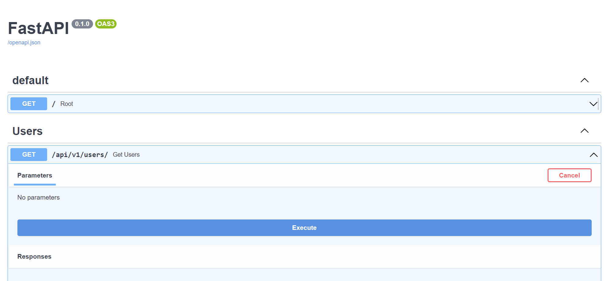

# serverless-fastapi
Simple Serverless FastAPI for AWS Lambda

## Install dependencies in the virtual env
```
pipenv install
```

## Run FastAPI
```
pipenv run uvicorn app.main:app --reload
```

## Test FastAPI endpoint
In your browser visit http://localhost:8000/docs
Here you can test your endpoint by clicking on the execute button.



<br/><br/>
